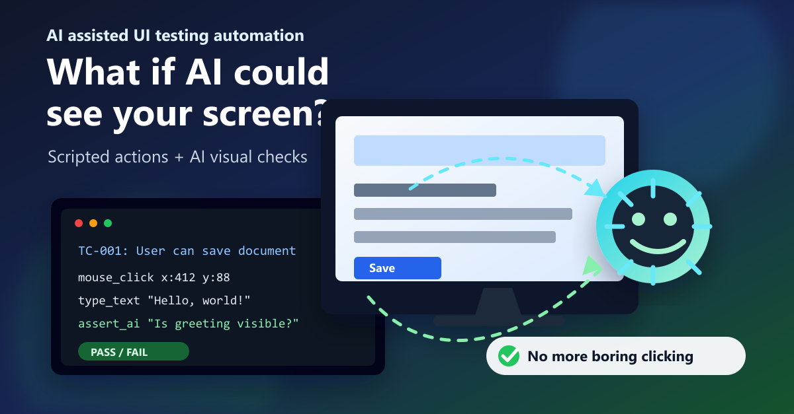

# UI Testing Framework



An AI-assisted UI test framework that drives a real desktop application **the same way a
human user would** — moving the mouse, clicking, dragging, and typing — and then **verifies
results by asking an AI agent questions about what is on screen**.

Instead of brittle selectors or accessibility-tree scraping, assertions are expressed as
plain-English questions ("Is the login dialog showing an error message?"). The runner takes a
screenshot (whole screen, a window, or a rectangle) and forwards the image plus the question to
an AI agent (`claude`, `codex`, or `cursor`). The agent answers, the runner parses a simple
`yes`/`no` (or `true`/`false`), and that becomes a **pass** or **fail**.

## Why this exists

Traditional UI automation breaks when a control's ID changes, a layout shifts, or an app has no
clean accessibility tree. This framework takes the opposite approach:

- **Test like a real user.** Actions are physical input (mouse + keyboard via the OS), so you
  exercise the app through exactly the path a person takes — no private hooks, no app
  instrumentation required.
- **Assert by perception, not selectors.** Validation is "does the screen look right?" answered
  by an AI vision agent, which is resilient to cosmetic/layout changes and reads dialogs, toasts,
  charts, and images the way a human reviewer would.
- **Readable by everyone.** Each step carries a plain-English `human` description next to the
  `machine` commands, so QA, devs, and stakeholders can review the same file.
- **Auditable results.** Every run emits an HTML report with **expected-vs-actual screenshots**
  for each check, so a pass/fail is always backed by visual evidence.

## How it works

A run flows through three stages (see the diagram above), repeated per step:

1. **Interact** — the runner performs real OS-level input (move, click, drag, type, key combos)
   to drive the app like a human.
2. **Capture** — it screenshots the whole screen, a specific window, or a rectangle.
3. **Verify with AI** — the screenshot + a plain-English question go to an AI agent, whose
   `yes`/`no` answer becomes a **pass** or **fail** (with optional retries + majority vote).

## Runners

Built in **Go** as **two front-ends over one shared Runner Core**:

- **`uitest` — CLI runner** for scripting/CI ([spec](docs/02-test-runner-spec.md)).
- **`uitest-gui` — GUI runner** built with [`webview/webview_go`](https://github.com/webview/webview_go),
  to pick a session, watch it run live, and review results ([spec](docs/04-gui-runner-spec.md)).

Every run produces a self-contained **`report.html`** that shows, for each assertion, **what
should be** (expected) next to **what actually is** (actual) ([spec](docs/05-report-spec.md)).

## Debug Mode (GUI runner)

The GUI runner includes an **IDE-style debugger** that lets you step through a test case one command at a time, set breakpoints, fix broken steps on the spot, and save the result back to the YAML — without leaving the runner.

### Enabling debug mode

Toggle the **🐞 Debug** button in the GUI before starting a run. In debug mode the runner pauses **before every individual machine command** instead of running steps end-to-end.

### Command Inspector

When paused, a panel slides up from the bottom showing the full command list for the current step, with an execution pointer (▶) on the command about to run — exactly like a breakpoint in a code debugger:

```
  ✓  focus_window "Visual Casino"
  ✓  mouse_click  Nav_Alerts (UIA)
▶    mouse_click  textBoxFirstName (UIA)  [New SIN Alert]
  ○  type_text    "John"
  ○  mouse_click  textBoxLastName (UIA)  [New SIN Alert]
```

Completed commands show ✓, the current command shows ▶, pending commands show ○. The left gutter shows ◌/● breakpoint dots — click to toggle, or press **F9**.

### Controls

| Action | What it does |
| --- | --- |
| **▶ Step** (F10) | Execute the current command and pause before the next one. |
| **▶▶ Run** (F5) | Run until the next breakpoint or end of the case. |
| **⏭ Skip** | Skip the current command without executing it and advance. |
| **⏺ Re-record Step** | Skip remaining commands in the step, then live-record your interactions. Stop recording to replace the step's `machine:` block with the captured commands. |
| **🗑 Delete Step** | Remove the entire step from the YAML immediately (with undo). |
| **Undo / Redo** | Step through YAML edits (delete, re-record) forward and backward. |
| **Drag ▶ row** | Drag the current-command row to any other row to jump execution forward or backward within the step. |

The Command Inspector panel can be **dragged upward** to reveal more of the step list. All test-case steps are shown in the left rail — done steps are collapsed, the current step is expanded, future steps are dimmed.

### Detachable debug panel

Click **↗ Detach** in the inspector topbar to pop the debug panel out into a separate browser window. This is useful on a second monitor or when you need the main GUI visible at the same time. The detached panel connects to the same runner session over HTTP and shows the same live state — paused command, breakpoints, step list. Click **↙ Attach** in the GUI to bring it back inline.

### Re-recording captures window scope

When recording a replacement step, the runner captures which top-level window each click lands in and automatically adds `target: {window: "..."}` next to every UIA-based command. This prevents the common bug where recorded UIA selectors resolve against the wrong window on replay.

### Recording a new session from scratch

The **📝 New Session** button on the picker page opens a form where you name the session, enter the application path, fill in the first case ID and name, then click **Start Recording**. Interact with your app normally, then **Stop & Save** — a save dialog appears and the runner writes a valid, schema-compliant `TestSession.yaml` ready for further editing.

## Technical details

| Area | Choice |
| --- | --- |
| Language | **Go** (single shared Runner Core; two front-ends compiled from it). |
| Input actuation | Pure-Go **Win32 `SendInput`** — real mouse/keyboard events at OS level (no app hooks). |
| Screen capture | **GDI** capture of full screen, a window by title, or a pixel rectangle. |
| Assertion engine | Pluggable **AI adapters** (`claude`, `codex`, `cursor`) invoked as CLI agents; built-in retries, majority vote, and response caching. |
| Test format | Human-readable **`TestSession.yaml`** — `human` intent + `machine` commands + `validation`/`assert`. |
| Reporting | Self-contained **`report.html`** + machine-readable **`results.json`**, with expected-vs-actual screenshots and a baseline-approval workflow. |
| GUI shell | [`webview/webview_go`](https://github.com/webview/webview_go) (HTML/CSS/JS UI bound to the Go core via an event bus). |
| Platform | **Windows** today; the core is structured so actuation/capture back-ends can be ported. |

> **Targeting note:** apps with a clean UI Automation tree (stable `AutomationId`s) can be driven
> far more robustly than by pixel coordinates. A real-world example (including hover-to-expand
> accordion navigation) is the **Visual Casino 8 smoke session**.
>
> **`VisualCasino8_Smoke.yaml` is intentionally NOT in this repo.** It contains environment
> credentials, so it is **gitignored** and kept with its own project at
> `C:\Source\Biometrica\VisualCasino8_experiments\visualcasino6\VisualCasino8_Smoke.yaml`.
> Treat it as the canonical large/real example when authoring new sessions.

## Documents

| Doc | Purpose |
| --- | --- |
| [docs/01-overview.md](docs/01-overview.md) | Vision, goals, glossary, high-level architecture (the "initial spec"). |
| [docs/02-test-runner-spec.md](docs/02-test-runner-spec.md) | Runner Core + CLI (`uitest`): lifecycle, command catalog, AI assertion engine. |
| [docs/03-testsession-yaml-spec.md](docs/03-testsession-yaml-spec.md) | The `TestSession.yaml` file format — human-readable schema and conventions. |
| [docs/04-gui-runner-spec.md](docs/04-gui-runner-spec.md) | GUI runner (`uitest-gui`): Go + webview, live run view, results. |
| [docs/05-report-spec.md](docs/05-report-spec.md) | HTML report: mandatory expected-vs-actual screenshots, baselines, data model. |
| [examples/TestSessionCases.yaml](examples/TestSessionCases.yaml) | A fully annotated, runnable-shaped example. |

## Structure of a test case

A **test case** is made of multiple **steps** plus a final **validation**:

- Each **step** has a **`human`** section (plain-English intent a stakeholder can approve) and a
  **`machine`** section (the literal commands the runner executes — `mouse_click`, `type_text`, …).
- The case ends with a **validation**: a `human` description of the acceptance criteria, whose
  machine equivalent is the **`assert`** section (AI yes/no checks that decide pass/fail).

```yaml
- id: TC-001
  name: "User can save the document"
  steps:
    - human: "Click the Save button on the toolbar"
      machine:
        - action: mouse_click
          target: { x: 412, y: 88 }
  validation:
    human: "A 'Save As' dialog should appear and no error is shown."
    assert:
      - action: assert_ai
        question: "Is a 'Save As' dialog visible on screen?"
        target: screen
        expect: yes
```

## Authoring in your editor (schema hints)

Session files come with a **JSON Schema** that gives **autocomplete, hover descriptions of every
command/field, and inline validation** in any editor backed by `yaml-language-server` (VS Code's
[`redhat.vscode-yaml`](https://marketplace.visualstudio.com/items?itemName=redhat.vscode-yaml),
Neovim, JetBrains).

The schema is **generated from the Go types**, so it can never drift from what the runner
accepts. It is committed at [`schema/testsession.schema.json`](schema/testsession.schema.json),
and you can regenerate it any time:

```powershell
./bin/uitest.exe schema -o schema/testsession.schema.json
```

Wire it up either way:

- **Per file** — add a modeline as the first line (used by the demo sessions):

  ```yaml
  # yaml-language-server: $schema=./schema/testsession.schema.json
  ```

- **Per workspace** — map it in `.vscode/settings.json` (already included here) so any
  `*.session.yaml` gets hints without a modeline:

  ```json
  { "yaml.schemas": { "./schema/testsession.schema.json": ["*.session.yaml"] } }
  ```

For files outside this repo, point `$schema` at the raw URL:
`https://raw.githubusercontent.com/felenko/UITestingFrameworkAIassisted/master/schema/testsession.schema.json`.

## Status

Both runners are **implemented** in Go and verified end-to-end on Windows:

- **`uitest` (CLI)** — `run`, `validate`, `list`, `doctor`, `approve`, `schema`; pure-Go Win32 actuation
  (SendInput), GDI screen capture, the AI assertion engine (claude/codex/cursor adapters with
  retries, majority vote, caching), and the self-contained `report.html` + `results.json`.
- **`uitest-gui` (GUI)** — `webview/webview_go` shell over the same core, with a session picker,
  overview tree, live run view (streamed events, live screenshots, assertion feed, log), and
  report access.

See **[BUILD.md](BUILD.md)** to build and run. Quick start:

```powershell
./build.ps1
./bin/uitest.exe doctor
./bin/uitest.exe run notepad-demo.yaml --open
```

> The GUI front-end requires a C toolchain (CGO) and the WebView2 runtime; the CLI does not.
